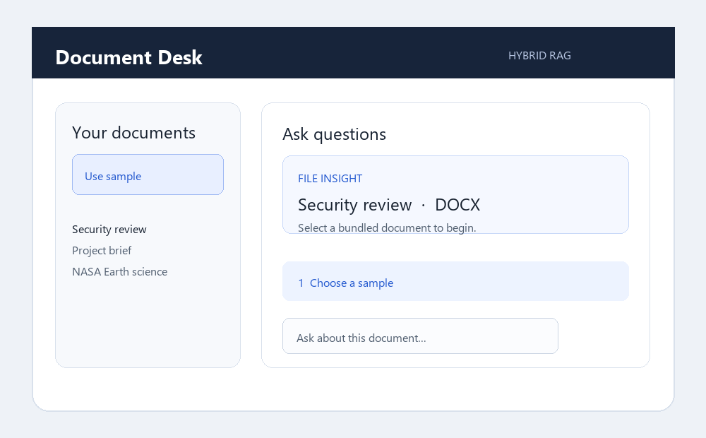

# Hybrid RAG

Hybrid RAG is a small, public document-intelligence demo. Upload a PDF, Word
document, Markdown file, or text file, then ask questions and receive a streamed
answer with supporting citations.

**Live demo:** [charan-hari.github.io/hybrid-rag](https://charan-hari.github.io/hybrid-rag/)

## What the demo does

- Drag-and-drop or select PDF, DOCX, Markdown, and TXT files.
- Show an immediate file insight card with a summary and visual signals.
- Bundle five sample documents so the demo can be tried without downloads.
- Extract text and metadata, split it into searchable sections, and persist it in Chroma.
- Combine dense feature-hash retrieval with BM25 keyword retrieval.
- Stream grounded answers from Gemini using Server-Sent Events.
- Show source/page citations and an honest insufficient-context response.
- Run on a static GitHub Pages frontend and a small FastAPI backend.

The default embedding implementation uses deterministic feature hashing rather
than PyTorch or transformer weights. This keeps the free Render deployment
small and avoids downloading a model during the first upload.

## Try the live demo

1. Open the [live demo](https://charan-hari.github.io/hybrid-rag/).
2. Choose **Use sample** or select your own PDF, DOCX, Markdown, or TXT file.
3. Review the file insight card while it is being indexed.
4. Ask a specific question, such as:

   - `What are the key takeaways?`
   - `What risks or controls are mentioned?`
   - `Give me a short summary with citations.`

The five bundled samples are in [`frontend/samples/`](frontend/samples/):

| Sample | Format | Demonstrates |
|---|---|---|
| Embedded images & tables | PDF | Research text, table-like content, and figures |
| Project brief | DOCX | Headings, priorities, owners, and delivery planning |
| Security review | DOCX | Risk ratings, controls, and action tracking |
| NASA Earth science | Markdown | Reference text and source links |
| NIST cybersecurity basics | Markdown | Structured guidance and named framework functions |

## Screenshots and demo recording

The live site is the source of truth for the current UI:

[Open the working demo](https://charan-hari.github.io/hybrid-rag/)

To add a real recording to the repository, capture the live page as
`docs/demo.gif` and place this directly below:

```markdown

```

This repository package does not include a fabricated recording; a screen
recording should be captured from the deployed site so it reflects the actual
backend connection and streamed answer behavior.

## Architecture

```text
GitHub Pages frontend
        │  HTTPS fetch + SSE
        ▼
FastAPI backend
        ├── PDF/DOCX/Markdown/TXT ingestion and chunking
        ├── Feature-hash vectors + Chroma persistence
        ├── BM25 keyword retrieval
        ├── Reciprocal-rank hybrid retrieval
        └── Gemini streamed generation with citations
```

## Repository layout

```text
backend/
  app/
    main.py          API endpoints
    ingestion.py     file loaders and chunking
    vectorstore.py   lightweight embeddings and Chroma
    retrieval.py     dense + BM25 hybrid retrieval
    generation.py    Gemini streaming and citations
  tests/
  Dockerfile
  requirements.txt
  .env.example
frontend/
  index.html
  app.js
  style.css
  samples/
.github/workflows/
```

## Deploy your own copy

### 1. Backend on Render

Create a Render Web Service from this repository:

- **Root directory:** `backend`
- **Runtime:** Docker
- **Health check path:** `/api/health`

Add these environment variables in Render:

```text
LLM_PROVIDER=gemini
GEMINI_API_KEY=your_gemini_key
GEMINI_MODEL=gemini-2.0-flash
CORS_ALLOW_ORIGINS=https://charan-hari.github.io
MAX_UPLOAD_MB=20
RATE_LIMIT_PER_MINUTE=30
USE_RERANKER=false
```

Never put `GEMINI_API_KEY` in the frontend, GitHub Pages, a ZIP file, or a
committed `.env` file. The free instance uses the lightweight embedder and
does not need PyTorch.

### 2. Frontend on GitHub Pages

The included workflow deploys `frontend/` from the `main` branch. The deployed
frontend already points to the configured backend through
`window.HYBRID_RAG_API_BASE` in [`frontend/index.html`](frontend/index.html).

If you use a different backend, change that URL and set
`CORS_ALLOW_ORIGINS` to the exact GitHub Pages origin.

## Run locally

```bash
cd backend
python -m venv .venv
.venv\Scripts\activate
pip install -r requirements.txt
copy .env.example .env
# Add GEMINI_API_KEY to backend/.env
uvicorn app.main:app --reload --port 7860
```

In another terminal:

```bash
python -m http.server 5500 --directory frontend
```

Then open `http://localhost:5500`.

## API

| Method | Endpoint | Purpose |
|---|---|---|
| GET | `/api/health` | Backend status and indexed section count |
| GET | `/api/documents` | Indexed document list |
| POST | `/api/ingest` | Add a PDF, DOCX, Markdown, or TXT file |
| POST | `/api/query` | Stream answer, citations, and completion events |
| DELETE | `/api/documents/{source}` | Remove one document |
| DELETE | `/api/reset` | Clear the index |

## Security and operating notes

- API keys belong only in server environment variables.
- CORS should be restricted to the deployed frontend origin.
- Upload size and request rate are configurable.
- Free Render storage is ephemeral; use a persistent disk if the index must
  survive service restarts.
- The public demo is intended for sample and non-sensitive documents.

## License

MIT — see [`LICENSE`](LICENSE).
